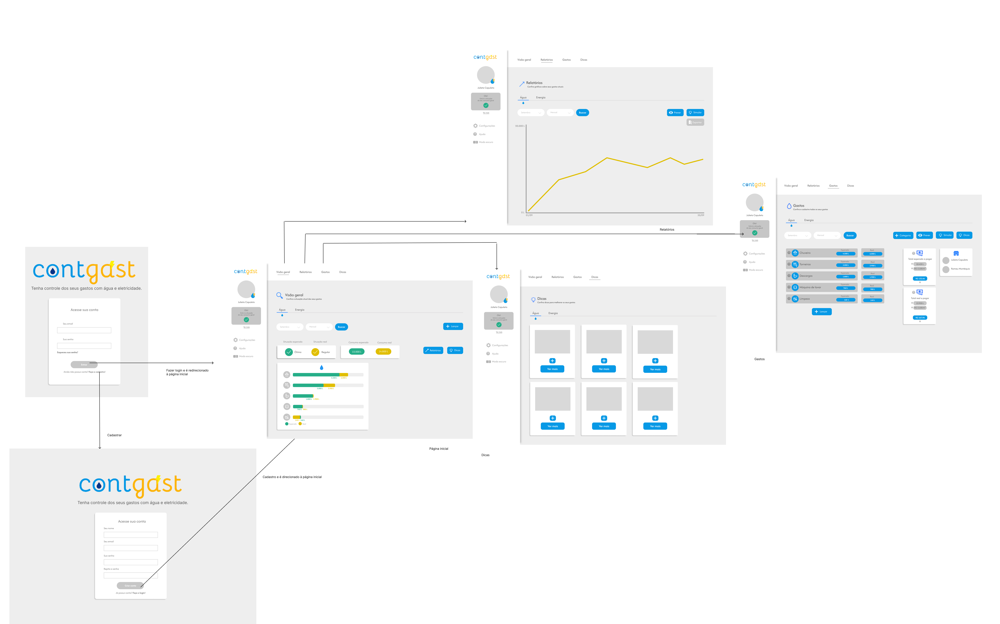
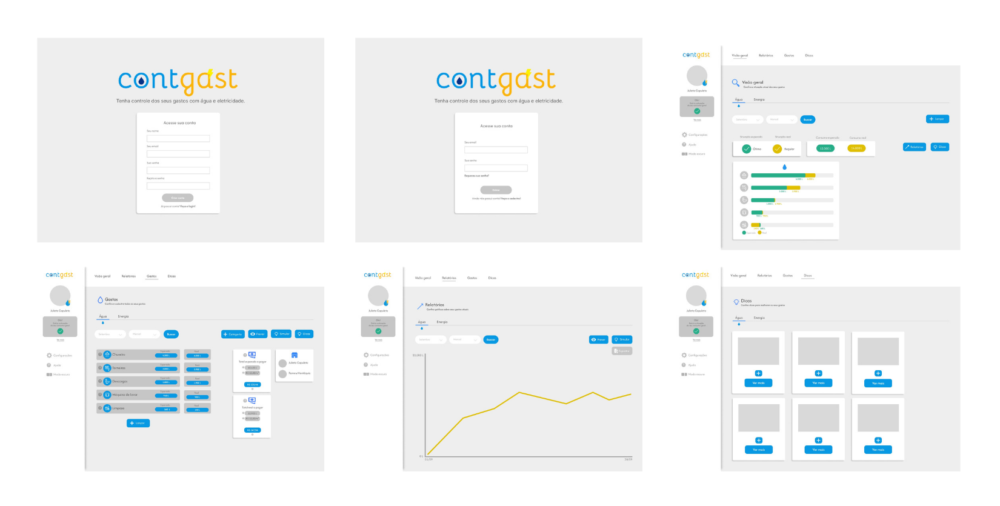
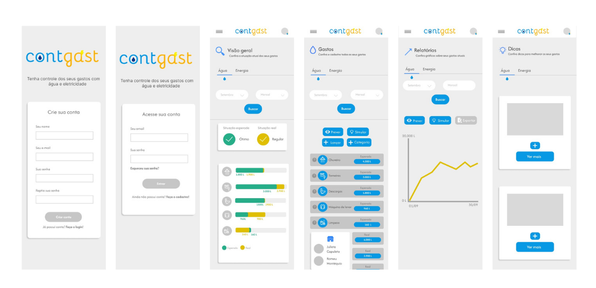

# Documentação do Projeto (TIDocs)

Esta pasta armazena a documentação do projeto para a disciplina de **Trabalho Interdisciplinar 1** dos cursos de Tecnologia da Informação da **[PUC Minas](https://pucminas.br)**. Essa documentação é estruturada na forma de um site que fica disponível por meio do GitHub Pages e pode ser incluído, também, no site da solução hospedada. Um [exemplo publicado do TIDocs](https://webtech-puc-minas.github.io/ti1-template/) está disponível por meio do repositório do **[WebTech PUC Minas](https://github.com/webtech-pucminas)**.

A documentação do projeto inclui as seguintes seções:

1. Introdução
2. Contexto
3. Concepção
4. Metodologia
5. Solução
6. FAQ (Questões frequentes)
7. Referências Bibliográficas

O template para o site é estruturado e permite que a equipe evolua a documentação do projeto à medida que avance no desenvolvimento.

# Orientações gerais

Esta seção traz explicações breves sobre o conjunto de artefatos que precisam ser incluídos na documentação do projeto com uma conjunto de links importantes para que se entenda como criar cada coisa. 

## Problema

Os brasileiros destinam, em média, cerca de 20% de sua renda ao pagamento de contas de água e energia elétrica. Contudo, muitos consumidores não compreendem claramente a origem desses valores. Frequentemente, durante o pagamento, não possuem plena consciência do seu consumo ou se o valor cobrado está de acordo com o uso real. Essas dúvidas levam a questionamentos como: o valor está adequado ao número de moradores? O consumo médio por pessoa está dentro do esperado? Existe a possibilidade de furtos de energia ou vazamentos de água que possam estar inflacionando os custos?
Em 2023, o furto de energia no Brasil atingiu um recorde. Segundo uma reportagem de Geral Campos Jr., publicada no site Poder360, as chamadas perdas não técnicas — popularmente conhecidas como "gatos" — aumentaram 20% em relação ao ano anterior, alcançando 40,8 terawatts por hora (TWh). Essa realidade agrava ainda mais a insegurança dos consumidores quanto à confiabilidade das suas contas, uma vez que muitos podem estar pagando por energia furtada sem sequer saber.
 Além disso, muitos consumidores carecem de informações claras sobre o histórico de seus gastos ao longo do tempo, o que dificulta a previsão de futuros valores e o acompanhamento de padrões de consumo. Isso impede uma gestão eficiente das despesas e limita comparações com a média nacional.
 Por fim, aqueles que buscam adotar um estilo de vida mais ecológico enfrentam dificuldades para entender como reduzir seu consumo de energia de maneira eficaz, limitando sua capacidade de contribuir para práticas sustentáveis e causas ambientais.

**Links Úteis**:

- [Objetivos, Problema de pesquisa e Justificativa](https://medium.com/@versioparole/objetivos-problema-de-pesquisa-e-justificativa-c98c8233b9c3)
- [Matriz Certezas, Suposições e Dúvidas](https://medium.com/educa%C3%A7%C3%A3o-fora-da-caixa/matriz-certezas-suposi%C3%A7%C3%B5es-e-d%C3%BAvidas-fa2263633655)
- [Brainstorming](https://www.euax.com.br/2018/09/brainstorming/)

## Objetivos

O ContGast foi desenvolvido com o objetivo de oferecer uma ferramenta eficaz para
o gerenciamento de contas de energia e água dos usuários, promovendo uma melhor
compreensão dos gastos passados e futuros. O objetivo geral do projeto é fornecer
uma plataforma prática que permita aos usuários mapear, registrar e armazenar suas
contas, facilitando o acompanhamento e controle do consumo de recursos
energéticos e hídricos.
Para atingir esse objetivo geral, foram definidos alguns objetivos específicos.
Primeiramente, o software visa fornecer suporte ao usuário na identificação de
possíveis inconsistências entre o consumo real e o valor cobrado, oferecendo
transparência e confiança na análise das contas. Em segundo lugar, o ContGast tem
como propósito apresentar orientações personalizadas para aqueles que desejam
reduzir seus gastos, promovendo o uso eficiente de energia e água. Por fim, o projeto
também inclui a criação de uma base de dados com o consumo médio de diferentes
aparelhos e eletrodomésticos, permitindo que o usuário saiba com precisão o quanto
cada equipamento consome e como isso impacta em suas despesas.
Dessa forma, o ContGast não só ajuda os usuários a monitorarem seus gastos, mas
também promove a educação sobre consumo consciente, alinhando-se com a
crescente demanda por soluções sustentáveis e financeiras.

## Justificativa

A compreensão deficiente dos gastos com água e energia elétrica gera insegurança
e insatisfação entre os consumidores brasileiros. Com uma média de 20% da renda
familiar destinada a essas contas, é alarmante que muitos não consigam rastrear a
origem desses valores ou verificar se refletem o consumo real. O aumento alarmante
de 20% nos furtos de energia em 2023, alcançando 40,8 TWh, destaca a urgência de
soluções que promovam transparência e educação no consumo.
Além disso, a falta de acesso a dados históricos sobre gastos impede uma análise
eficaz e a tomada de decisões informadas. O nosso projeto se propõe a sanar essas
lacunas, oferecendo uma plataforma que não apenas informa, mas empodera os
consumidores a monitorar e gerenciar seus gastos. Isso não só ajudará a esclarecer
a confiabilidade das contas, mas também incentivará práticas mais sustentáveis.

## Público-Alvo

O público-alvo do ContGast é diversificado, abrangendo adultos e jovens adultos na
faixa etária de 20 a 40 anos. Esses indivíduos, geralmente com nível de escolaridade
médio a superior, estão em busca de uma compreensão mais profunda sobre suas
contas de água e energia elétrica. Muitos deles residem em áreas urbanas, onde os
custos com esses serviços podem ser mais elevados e variados.
Esse grupo inclui consumidores que questionam a precisão das cobranças e desejam
monitorar seus gastos de forma mais eficaz. Além disso, o software é especialmente
relevante para aqueles que aspiram a um estilo de vida mais sustentável, promovendo
práticas ecológicas. As funcionalidades do ContGast, como simulações de gastos com
diferentes fontes energéticas, visam não apenas fornecer informações, mas também
capacitar os usuários a fazer escolhas mais conscientes.

## Personas

**EU COMO... PERSONA
QUERO/PRECISO... FUNCIONALIDADE
PARA... MOTIVO**

- Marcela precisa utilizar o comparador de gastos para investigar o consumo de energia na sua residência.  
Mora só e não concorda com o valor que paga pelas contas. O Comparador de gastos servirá como um artifício para questionar o valor cobrado pela distribuidora de energia de sua cidade.

- Guilherme Santava, usuário comum extremamente preocupado com o meio-ambiente querendo diminuir drasticamente seus consumos hídricos.  
Entusiasta do mundo ecológico quer levar um estilo de vida mais voltado à simplicidade e busca encontrar a fonte de maior gasto.

- Usuário Anônimo, busca conferir seus gastos mensais com auxílio da ferramenta, sem a necessidade de login.  
Uma possível fonte de dicas para realizar alterações e ter um menor consumo.

-  Usuário Logado, busca investigar o consumo de energia e água em residências com a possibilidade de analisar e cadastrar histórico de consumo.  
Usando o comparador como uma oportunidade para entender o quanto o desleixo de esquecer aparelhos ligados e luzes acesas desnecessariamente pesa no valor da conta ao fim do mês.

## Histórias de Usuários

Marcela Almeida: "Como usuária, desejo aprender sobre outras formas de energia
para contribuir com a preservação do meio ambiente."

Joel Santos: "Como usuário, quero verificar os gastos da minha residência para
assegurar que estão corretos e que não estou sendo cobrado indevidamente."

Clara Matos: "Como usuária, gostaria que o site armazenasse meus dados para que
eu possa acompanhar minha vida financeira de forma contínua."

Gabriel Santana: "Como usuário, desejo que o site me indique a quantidade ideal de
água a ser consumida em minha residência, com o objetivo de contribuir para a
proteção do meio ambiente."

## Requisitos

Lista de requisitos Funcionais e não funcionais
Funcionais:

RF-001: O sistema deve gerar gráficos baseados no consumo de água e energia do 
usuário, exibindo informações diárias, semanais e mensais. -Prioridade Alta.

RF-002: O sistema deve exibir um status de desempenho (Péssimo, Ruim, Regular, 
Bom, Ótimo) com base na avaliação do consumo de água e energia do usuário. -
Prioridade Baixa

RF-003: O sistema deve calcular e exibir a diferença entre o consumo real do 
usuário e o consumo esperado. -Prioridade Média

RF-004: O sistema deve calcular o consumo de água e energia com base no número 
de pessoas na residência e nos eletrodomésticos cadastrados. -Prioridade Média

RF-005: O sistema deve mostrar dicas de economia de água e energia. -Prioridade 
Baixa

RF-006: O sistema deve permitir a exportação dos dados de consumo. -Prioridade 
Média

RF-007: O sistema deve apresentar uma tabela com produtos e seu respectivo gasto 
de água ou energia. -Prioridade Média

RF-008: O sistema deve exibir o histórico de consumo de água e energia do usuário. 
-Prioridade Média

RF-009: O sistema deve possuir um layout que permita ao usuário escolher entre 
comparar o consumo de água ou de energia. -Prioridade Alta

RF-010: O sistema deve calcular o consumo esperado do usuário, com base em 
fatores definidos, como o número de residentes e tipo de eletrodomésticos. -
Prioridade Alta

RF-011: O sistema deve fornecer previsões de gastos futuros com base nos padrões 
de consumo anteriores. -Prioridade Média

RF-012: O sistema deve permitir a simulação da economia de energia ao utilizar 
outras fontes de energia alternativas. -Prioridade Baixa

RF-013: O sistema deve permitir ao usuário comparar o valor mensal de suas contas 
de água e energia. -Prioridade Alta

Não Funcionais:

RNF-001: O site deve ser responsivo, adaptando-se a diferentes tamanhos de tela e 
dispositivos. -Prioridade Alta

RNF-002: O sistema deve processar rapidamente as requisições do usuário, com 
tempo de resposta não superior a 5 segundos. -Prioridade Média

RNF-003: O site deve ser fácil de usar, garantindo uma experiência intuitiva e 
acessível para todos os usuários. -Prioridade Alta

RNF-004: O site deve ser seguro, implementando medidas de proteção de dados e 
privacidade dos usuários. -Prioridade Alta

RNF-005: O site deve ser compatível com os principais navegadores, incluindo 
Chrome, Firefox, Safari e Edge. -Prioridade Alta

RNF-006: O site deve operar de forma contínua, garantindo disponibilidade 24 horas 
por dia, 7 dias por semana. -Prioridade Média
**Links Úteis**:

- [O que são Requisitos Funcionais e Requisitos Não Funcionais?](https://codificar.com.br/requisitos-funcionais-nao-funcionais/)
- [O que são requisitos funcionais e requisitos não funcionais?](https://analisederequisitos.com.br/requisitos-funcionais-e-requisitos-nao-funcionais-o-que-sao/)

## User Flow

O fluxo de usuário (User Flow) é uma técnica que permite ao desenvolvedor mapear todo fluxo de telas do site ou app. Essa técnica funciona para alinhar os caminhos e as possíveis ações que o usuário pode fazer junto com os membros de sua equipe. 

No link a seguir, está representado o User Flow entre os protótipos das telas que compõem o sistema ContGast.

 - [User Flow Figma](https://www.figma.com/design/oi5DgFxqOPBsD0stUMQ0jn/User-Flow?node-id=0-1&t=I2f0MCytSmgya09c-1)

## Wireframes

A interface do ContGast foi projetada com foco em simplicidade e didática, assegurando fácil uso por qualquer usuário. A identidade visual da aplicação é composta pelas cores predominantes branco, azul e amarelo. A interface, disponível nas versões web e mobile, é composta por quatro páginas principais: "Visão Geral", "Relatórios", "Gastos" e "Dicas". A função de cada uma dessas telas será detalhada posteriormente. Além disso, a interface foi projetada para conter ícones de ajuda distribuídos pelas telas, facilitando a compreensão de cada seção e reforçando o caráter didático do sistema.

A seguir, serão explicadas cada uma das telas da interface do sistema, e, em seguida, apresentaremos os links de cada um dos protótipos.

Tela inicial: Nessa tela, o usuário obtém uma panorama geral de seus gastos reais e esperados de água e energia em um determinado período.

Relatórios: Essa tela permite a visualização de gráficos detalhados sobre o consumo do usuário em um determinado período. O usuário também pode prever o consumo futuro com base nos dados atuais, simular o valor das contas ao seguir dicas de economia, e exportar relatórios para Excel.

Gastos: Nessa tela, o usuário pode cadastrar categorias de gastos, acompanhar o consumo real e esperado de cada item, acompanhar os valores reais e esperados das contas mensais e registrar novos gastos.

Dicas: Essa tela exibe sugestões de economia fornecidas pelo sistema. O usuário pode seguir determinadas dicas, e o consumo esperado será ajustado com base nas dicas aplicadas.

Para acessar o repositório interativo na versão web, **[clique aqui.](https://www.figma.com/proto/6fZOCVAmiKTQvtfgX6iJIC/Interface-Web?node-id=52-419&node-type=canvas&t=6bafcn79ZTXnPp0q-1&scaling=min-zoom&content-scaling=fixed&page-id=23%3A279&starting-point-node-id=81%3A133)**

Para acessar o repositório interativo na versão mobile, **[clique aqui.](https://www.figma.com/proto/IoxKG9q25EMcx8i8Fj7ZC5/Interface-Mobile?node-id=34-1168&node-type=canvas&t=lM5OC5u9wQs8142I-1&scaling=contain&content-scaling=fixed&page-id=12%3A2&starting-point-node-id=34%3A1168)**

## Gestão de Projetos

Durante o desenvolvimento deste projeto, adotamos o framework Scrum, designando Arthur Lacorte como Scrum Master e Victor Torres como Product Owner (PO) para facilitar a organização e a eficiência do time. Essa estrutura nos permitiu dividir as tarefas de maneira estratégica, levando em consideração as habilidades específicas de cada desenvolvedor — Adrielly Lima, Arthur Lacorte, Arthur Moura, Guilherme Coelho, Victor Torres e Victor Wilson — e priorizando entregas de forma ágil e contínua. A documentação do projeto foi realizada por toda a equipe, assegurando que cada etapa do processo estivesse devidamente registrada e acessível a todos.

Além disso, utilizamos o método Kanban para acompanhar o progresso das atividades, organizando nosso fluxo de trabalho em três quadros: um para tarefas não começadas, um para tarefas em andamento e um para tarefas concluídas. Essa abordagem se mostrou extremamente útil para a designação correta das tarefas e para a organização geral do projeto, proporcionando uma visão clara sobre ações pendentes e concluídas, garantindo transparência e coordenação entre os membros da equipe.

Empregamos a plataforma Miro para estruturar nossas atividades de Design Thinking, o que foi fundamental para aprofundar nossa compreensão do projeto e identificar oportunidades de melhorias. O Figma foi a plataforma escolhida para elaborar os fluxos de usuário, wireframes das telas e o protótipo interativo, assegurando uma experiência de usuário bem estruturada e coerente com os objetivos do projeto. Além disso, utilizamos o GitHub como repositório de código, permitindo um controle eficiente de versionamento e garantindo que todo o processo estivesse devidamente documentado.

- [Figma - Wireframes das telas e protótipo interativo](https://www.figma.com)
- [Miro - Ferramenta para etapa do Design Thinking](https://miro.com/pt/)
- [GitHub - Repositório de Código e Documentação](https://github.com)

